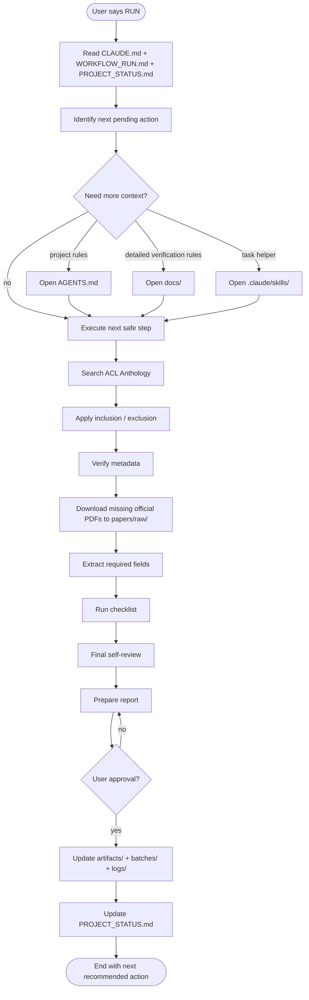

# Workflow Diagram — Bangla NLP Thesis Review

How the project continues from its saved state when the user says `RUN`.

## What each file is for

- **`CLAUDE.md`** — project entry point.
- **`WORKFLOW_RUN.md`** — defines the `RUN` command behavior.
- **`PROJECT_STATUS.md`** — persistent memory / current state.
- **`AGENTS.md`** — portable project rules (opened lazily).
- **`docs/`** — detailed verification references (opened lazily).
- **`.claude/skills/`** — optional task helpers (opened lazily).
- **`logs/`** — research history (searches, rejected papers).
- **`artifacts/`** — final thesis outputs (matrix + literature review).
